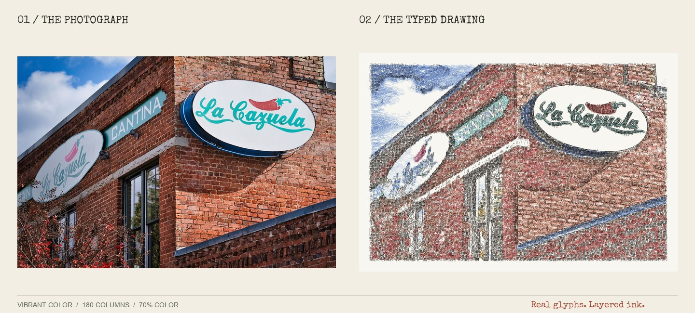
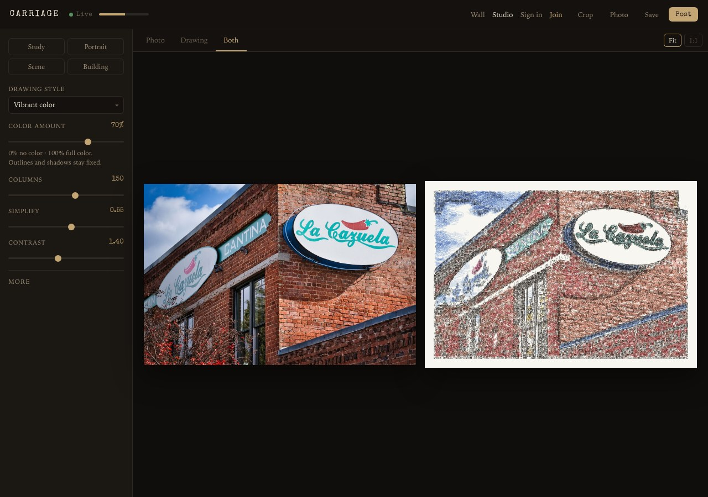
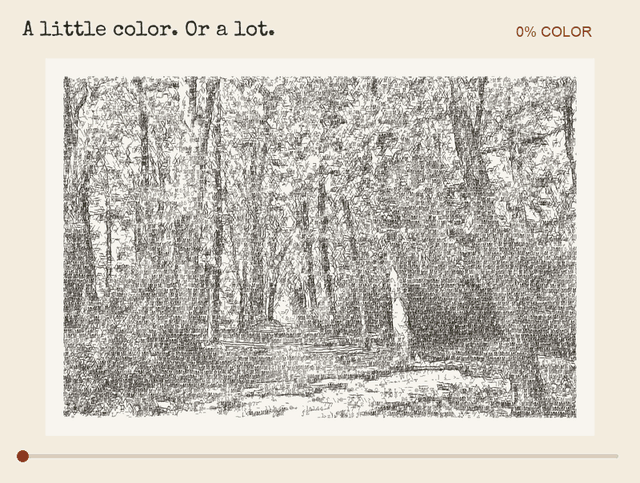
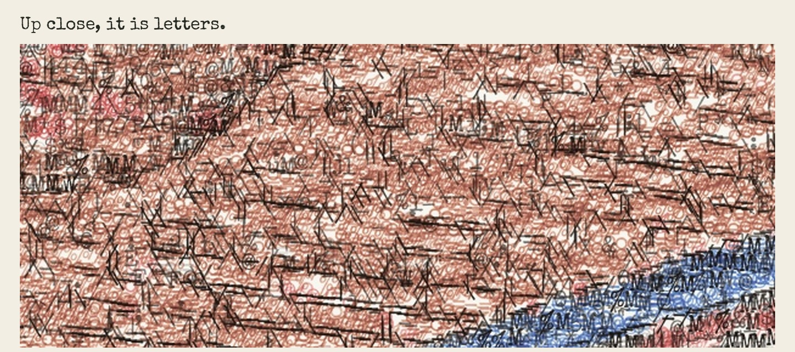
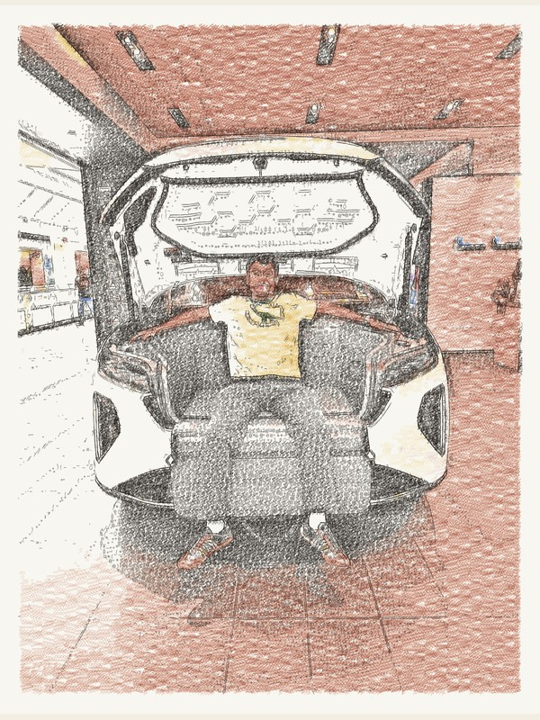
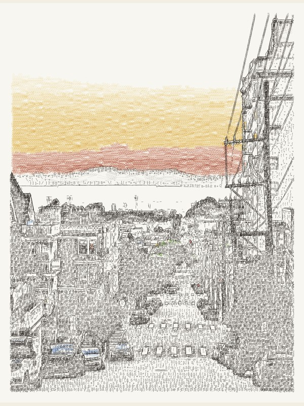
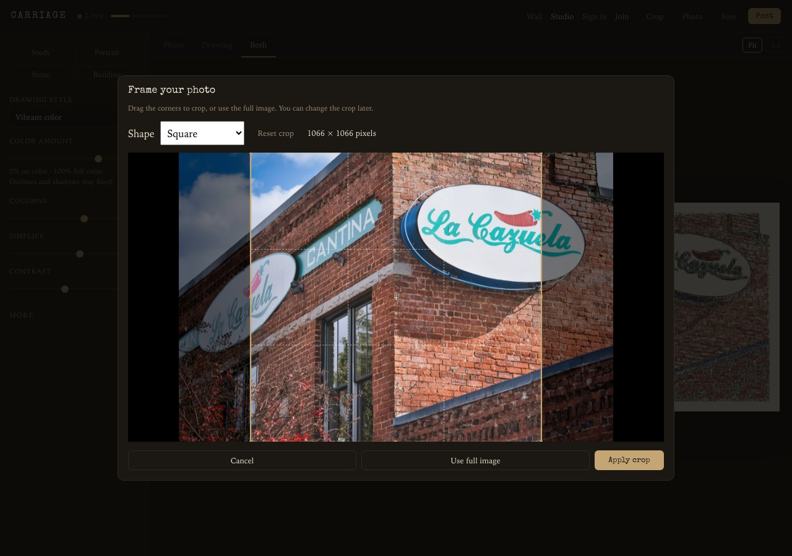

<div align="center">

# Carriage

### Photographs, redrawn in type.

From across the room, a drawing. Up close, letters, punctuation, and layers of colored ink.

**[Open the Studio](https://carriage-typewriter.fly.dev/studio)** · **[Explore the wall](https://carriage-typewriter.fly.dev/)** · **[Run locally](#run-locally)**

*Try it and download a drawing without an account.*

[](https://carriage-typewriter.fly.dev/studio)

</div>

Carriage turns your photographs into typewriter drawings using actual font glyphs: letters follow edges, overlapping impressions build shadows, and colored ribbons bring the scene back to life. A Python renderer does the drawing; the browser is your studio.

## Make a page of your own

1. **Drop a photograph** into the [Studio](https://carriage-typewriter.fly.dev/studio). Frame it with the crop tool, or keep the full image.
2. **Find your drawing.** Adjust color, detail, contrast, paper, and ribbon. Switch between **Photo**, **Drawing**, and **Both** as you work.
3. **Save the image.** Sign in if you want to post it to the shared wall, with the original alongside it.

[](https://carriage-typewriter.fly.dev/studio)

## A little color. Or a lot.

Move **Color amount** from **0% to 100%**. The black drawing stays fixed while the colored impressions fade in. The slider updates immediately, so you can find the balance without waiting for another render.

<p align="center">
  <a href="https://carriage-typewriter.fly.dev/studio"></a>
</p>

*Actual Vibrant color output at 180 columns. The animation blends the same lossless color endpoints used by the Studio.*

## Every mark is a key

Edges, texture, and shade are built from whole character impressions. Zoom into the brickwork from the opening example:

[](docs/media/glyph-detail.jpg)

The renderer follows contours, lays down tonal marks, and adds colored glyphs in separate passes. It runs with **Pillow and NumPy**, without a model download or an external image-generation API.

## From the wall

Open a page to compare its saved **Drawing**, **Photo**, and **Both** views. Click the drawing to inspect it at print size.

<table>
  <tr>
    <td align="center" width="50%">
      <a href="https://carriage-typewriter.fly.dev/p/43"></a><br>
      <strong><a href="https://carriage-typewriter.fly.dev/p/43">Lucid ↗</a></strong>
    </td>
    <td align="center" width="50%">
      <a href="https://carriage-typewriter.fly.dev/p/33"></a><br>
      <strong><a href="https://carriage-typewriter.fly.dev/p/33">SF ↗</a></strong>
    </td>
  </tr>
</table>

**More pages:** [Crow](https://carriage-typewriter.fly.dev/p/31) · [Harvard](https://carriage-typewriter.fly.dev/p/19) · [Fish](https://carriage-typewriter.fly.dev/p/7) · [Browse everything](https://carriage-typewriter.fly.dev/)

*Wall pages are saved snapshots. Updating the renderer does not change existing posts.*

## Your photo, your framing

Crop before the first render. Choose free crop, square, 4:3, 3:4, or 16:9; drag the selection; reset; or use the whole photograph. **Crop** reopens the original so you can reframe later. The preview, download, and posted source all use the same selection.

<p align="center">
  
</p>

## Pick your type

| Drawing style | What it does |
| --- | --- |
| **Vibrant color** · default | Layers a wider ribbon palette over the black drawing for stronger color coverage. |
| **Typed illustration** · preview | Fits characters to local shapes and discourages repeated keys in nearby marks. |
| **Refined color** | An earlier layered-color renderer, retained for comparison. |
| **Earlier color** | The first ribbon-color approach. |
| **New monochrome** | Contour and tonal drawing without colored impressions. |
| **Original algorithm** | The original grid-based renderer, including text and HTML exports. |

**Columns**, **Simplify**, and **Contrast** shape the drawing. Under **More**, change the keys, paper, ribbon, pressure, and overstrike. **Dark fill** controls shadow coverage in Vibrant color and Typed illustration, independently of color amount. **Save** exports a PNG for the newer styles; the original style exports a JPEG.

Typed illustration is an opt-in experiment. It adds character variety, but dense textures and subtle colors still need work. See the [six-photo study](docs/typed-illustration.md) and [algorithm review](docs/algorithm-review-2026-09-18.md) for comparisons and current limitations.

## Run locally

Use **Python 3.12+**. No cloud account or API key is needed for local rendering.

```bash
git clone https://github.com/luke-mcevoy/TypeWritterPhotoGenerator.git
cd TypeWritterPhotoGenerator
python3 -m venv .venv
source .venv/bin/activate
pip install -r requirements.txt
python app.py
```

Open **[localhost:5001](http://127.0.0.1:5001)**. Local accounts, drawings, and uploaded photographs are stored in the gitignored `data/` directory. Set `PORT` to use a different port, or `FLASK_DEBUG=1` for development mode.

<details>
<summary><strong>Renderer studies and tests</strong></summary>

Compare the color renderers or the illustration preview on your own photographs:

```bash
python -m experiments.vibrant_study your-photo.jpg
python -m experiments.illustration_study --columns 180 your-photo.jpg
```

The studies write browsable galleries to `output/algorithm-comparison/vibrant/` and `output/algorithm-comparison/illustrated/`, including source photographs, rendered pages, and color controls.

```bash
python -m unittest discover -s tests -v
python -m unittest discover -s experiments -p 'test_*.py'
```

Start with [`drawing/contour_engine.py`](drawing/contour_engine.py) for the rendering pipeline, [`drawing/illustration.py`](drawing/illustration.py) for the preview, [`app.py`](app.py) for the Flask app, and [`static/app.js`](static/app.js) for the Studio.

</details>

<details>
<summary><strong>Storage and deployment</strong></summary>

The app uses Flask, SQLite, and a vanilla JavaScript frontend. Gunicorn serves the production container on Fly.io.

| Setting | Purpose |
| --- | --- |
| `SECRET_KEY` | Flask session-signing key. Locally, a persistent key is created in `data/` if unset. |
| `CARRIAGE_INVITE` | Optional invite code for account creation. |
| `BUCKET_NAME` | Enable object storage for photographs and drawings; otherwise use local `data/posts/`. |
| `AWS_ENDPOINT_URL_S3`, `AWS_REGION` | Configure the S3-compatible store; defaults target Tigris. Use standard AWS credentials. |
| `MEDIA_PUBLIC_URL` | Optional public media base URL. |

The production app keeps SQLite on the Fly volume mounted at `/app/data` and images in Tigris object storage. See [`fly.toml`](fly.toml), [`Dockerfile`](Dockerfile), and [`storage.py`](storage.py) for configuration. To self-host, use your own Fly app, volume, and storage credentials.

For maintainers deploying the existing app:

```bash
fly deploy --app carriage-typewriter
```

The [GitHub Actions workflow](.github/workflows/fly-deploy.yml) also deploys pushes to `main` and `master` when `FLY_API_TOKEN` is configured. The app can sleep when idle, so a first visit may take a few seconds to wake it.

To temporarily share a local instance instead, run [`./serve-public.sh`](serve-public.sh). Its Cloudflare URL lasts only while the process and this machine remain running; posts stay in the local `data/` directory.

</details>

---

Inspired by the craft of typewriter drawing, including [James Cook's work](https://www.jamescookartworkshop.com/collections/shop). Carriage is an independent software experiment.

[Image credits and demo settings](docs/media/README.md) · [Special Elite font license](fonts/LICENSE.txt)
