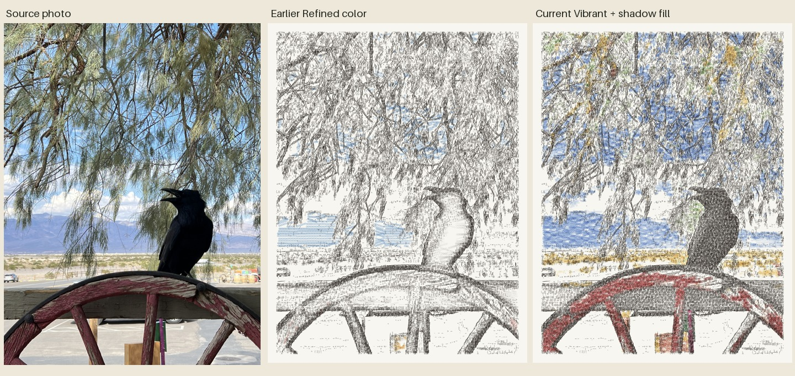
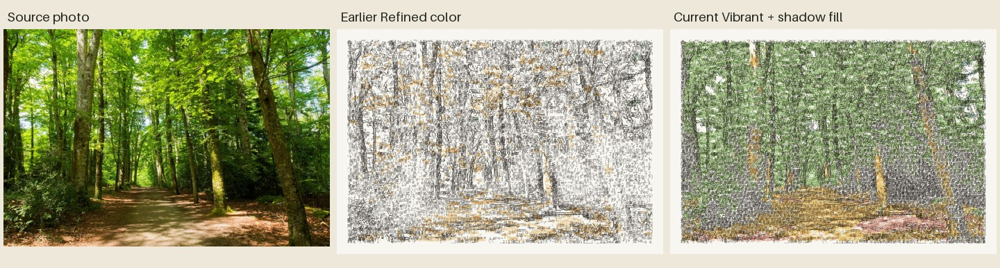

# Algorithm review — 18 September 2026

The renderer has improved photographic color coverage and fixed hollow dark
subjects, but those gains do not by themselves bring it closer to the reference
art. We have been optimizing where ink appears more than how characters build
a deliberate drawing. Keep the useful fixes; change the next development goal.

## Reference and evidence

Reviewed the current public [SF drawing, post 33](https://carriage-typewriter.fly.dev/p/33),
the existing nature/building comparisons, and Cook's
[Crossing Paths, Manhattan](https://www.jamescookartworkshop.com/products/crossing-paths-manhattan)
and [Evening in Tokyo](https://www.jamescookartworkshop.com/products/evening-in-tokyo).
The following aesthetic observations are my visual assessment, not claims about
an undisclosed production technique.

Cook's characters form recognizable patterns, lettering and contours. Objects
have differentiated textures and clear boundaries. In Crossing Paths, color
helps particular objects stand out; its product description explicitly discusses
colored ribbons emphasizing street details. Tokyo also contains very dense black
areas and extensive color. Therefore “less color,” “less black” or “more blank
paper everywhere” would each be an incomplete interpretation of the reference.

## Where our algorithm diverges

1. **Photographic tone drives the drawing.** `drawing/contour_engine.py` fits
   character masks to pixel residuals and average darkness. It traces edges but
   does not plan windows, masonry, foliage or lettering as distinct structures.
   Dense, repetitive character texture can obscure the subject's hierarchy.
2. **Color follows eligible pixels rather than visual importance.**
   `drawing/vibrant_color.py` maps hue to nine pigments and deposits three feeds
   of short character runs. Broad colored backgrounds can receive more emphasis
   than small important details. The SF sky's repeated colored texture is a
   concrete example. More saturation is not the missing artistic decision.
3. **Color rejection creates gaps.** Confidence cutoffs, small-region rejection
   and the 55% neighborhood-support rule can discard subtle hues, thin structures
   and transitions. Increasing Color amount only strengthens the accepted marks.
4. **The hollow-object fix is useful but indiscriminate.**
   `drawing/shadow_tone.py` preserves an absolute darkness floor. It restores the
   raven/cows, but it cannot distinguish a focal subject from a dark background.
   Shadow fill controls intensity, not that distinction. Simply removing this
   fix would bring back the original failure.
5. **The tests protect behavior, not artistic quality.** Repeatability, glyph-only
   rendering, color interpolation and coverage checks are valuable. They do not
   establish that an image has convincing composition or resembles the reference.

## Recommended next work

- Plan coherent regions and connected contours before placing texture. Preserve
  recognizable silhouettes and reserve quiet areas deliberately.
- Choose character families, spacing and repeated runs for the structure being
  described. Use clearer rhythms for windows and surfaces; cluster marks for
  foliage. Keep readable characters where they help rather than relying on more
  overlap throughout the image.
- Give color an emphasis budget across regions, with a way to select important
  objects. Use soft confidence transitions so pale colors do not vanish abruptly.
- Retain dark interiors but allocate their density by region and importance.
  Evaluate both daytime and nighttime work; dense blacks are sometimes correct.
- Compare source/current/candidate on the same diverse photo set at thumbnail and
  close-up sizes. Judge subject readability, texture organization, color emphasis
  and intentional whitespace separately. Do not select winners by coverage alone.

No renderer formulas or defaults were changed in this review. Cropping improves
framing, but does not solve the missing region and character planning.

## Current improvements, illustrated

These are freshly rendered comparisons of the earlier Refined mode against the
current Vibrant mode, not a new artistic algorithm created during this review.
Both use 150 columns, 70% color, contrast 1.4, simplify .55 and pressure .88.
Vibrant uses the current default of 100% Shadow fill. All marks are glyphs.

The earlier renderer leaves the crow's interior almost white. The absolute
shadow target asks the character fitter to retain its dark body. The wider color
planner also retains more blue sky and the red wheel. Source: the user's public
[Crow photograph, post 31](https://carriage-typewriter.fly.dev/p/31).

Yellow-green foliage no longer falls out of the palette so easily; additional
colored character impressions make the canopy read green. Dark trunks gain body.
The remaining weakness is visible too: texture is repetitive and the result lacks
the original light hierarchy. Photo: Arnauld van Wambeke,
[Path in Forest in Sunlight, Pexels](https://www.pexels.com/photo/path-in-forest-in-sunlight-24706137/).

The interactive local comparison is at http://127.0.0.1:8008/review-examples/.
It was generated with `python -m experiments.vibrant_study` using those two
source photos. The linked JPEG sheets are included in the repository.

## Repository and production state

At review time GitHub's `main` and local HEAD were both `75889ef`, while the recent
renderer, Studio and experiment work was still uncommitted. Fly was healthy on
release 17, image `deployment-01M2786VKVSSYWSSFEMX9CF09H`. SHA-256 checks of the
live contour, vibrant-color and shadow-tone files exactly matched the local
versions. Production had advanced beyond the last entry in the session journal.

The new upload crop workflow adds free/preset aspect ratios, reset, cancel and
full-image choices. Reopening Crop retains the original photo and selection.
The cropped photo is used consistently for preview, export and posting. This
review and crop work are being committed to GitHub; no new Fly deployment is part
of this review.
