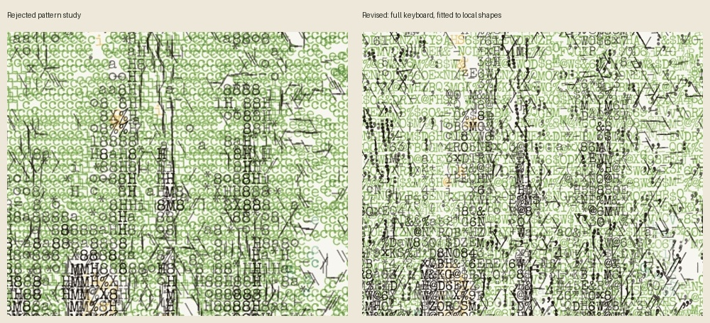
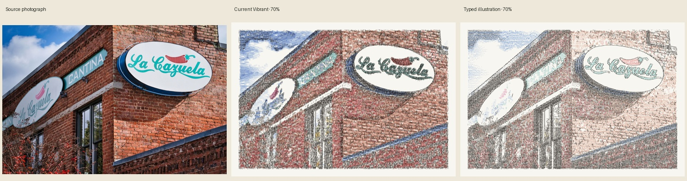

# Detailed type study — 18 September 2026

The first region-pattern prototype was too repetitive. In its forest output,
`c` accounted for 8,993 of 25,397 impressions (35%). The user rejected the
appearance. Coherence cannot mean prescribing a few keys to every surface.

The revised `illustrated` mode fits the full selected keyboard to local shapes.
Surface direction supplies a small preference, never a restricted alphabet.
Recent character use in each local area breaks ties between plausible fits;
candidates below 82% of the best fit remain ineligible. Colored impressions
now fit the residual shape too, instead of repeating a region's chosen letter.
Contours fit a selection of straight, curved and punctuation keys to the local
edge. Fine source detail supplements the broad shadow and highlight plan.

Everything printed is still a complete upright glyph. Dark interiors remain
filled, and color fades between fixed lossless endpoints without changing the
black drawing. Export scale uses the same strike plan. No source pixels or
reference artwork are painted onto the output.

## Inspect the result

- Local gallery: http://127.0.0.1:8008/illustrated/
- Local Studio: http://127.0.0.1:5012/studio → **Typed illustration (preview)**.
- The gallery compares source/current Vibrant/revised drawing on the crow,
  sunlit forest, brick facade, colored houses, San Francisco and night city.
  Both renderers use 180 columns, 70% color, full shadow fill, contrast 1.4,
  simplify .55, pressure .88, overstrike 1 and seed 7. Source hashes, settings,
  renderer hashes and timings are saved beside the generated gallery.

## Assessment

Character variety and readable fine marks improve over the rejected repeated
patterns. Shadows and boundaries remain recognizable. These are visual study
results, not evidence that the renderer has reached the reference's artistic
quality. Some surfaces still look like dense text, muted hues remain weak, and
open-background detection can suppress an important broad color field.

Cook's deliberate lettering, individually interpreted objects and composition
remain the substantial gap. The algorithm still infers geometry and hue; it
does not understand windows, faces, signs or trees as objects. More different
keys alone cannot produce that judgment. The reference is
[Crossing Paths, Manhattan](https://www.jamescookartworkshop.com/products/crossing-paths-manhattan)
and [Evening in Tokyo](https://www.jamescookartworkshop.com/products/evening-in-tokyo).

The preview remains optional and local; the default and production posts have
not changed. Reproduce with `python -m experiments.illustration_study --columns
180 PHOTO...`. Photo credits for the existing nature/building inputs are in
`experiments/scene_validation.json`; the crow and SF sources are the user's
public posts 31 and 33. Reference artwork is not included in the repository.

Validation: 26 application/renderer tests and 23 historical experiment tests
pass. The Studio browser test covers all six styles, exact instant color fades,
PNG export, mobile layout and an authenticated post in a disposable local DB.
The gallery browser check covers all 18 version selections and 36 color/download
states. Tests protect these behaviors; aesthetic quality still requires review.
